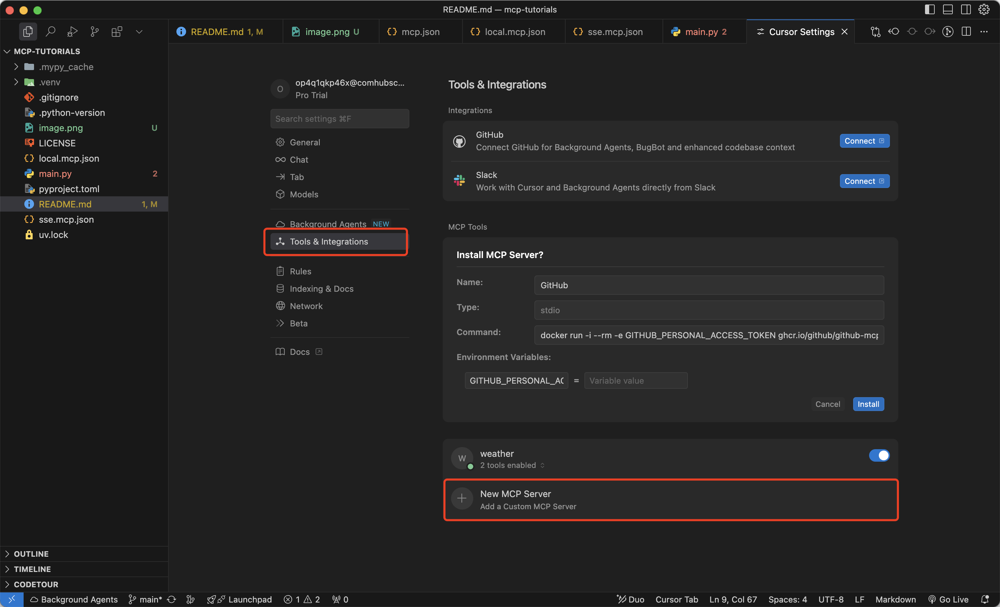

# mcp-tutorials

Learn mcp.

1. <https://modelcontextprotocol.io/quickstart/server>

## how to use mcp server in cursor?

1. update your cursor to the latest version, my version is: 1.1.3 (Universal). in the cursor menu, click: Cursor -> About Cursor, to check your version. 
2. in the cursor menu, click: Cursor -> Settings -> Cursor Settings 
3. in the Cursor Settings, click: Tools & Integrations -> New MCP Server 
4. in the popped up mcp.json file, copy the `sse.mcp.json` content, and paste it into the mcp.json file, and save it. 
5. back to the Cursor Settings, you will see the weather mcp server is added. 
6. open a new chat window, input: `what is the weather of New York?`, when cursor pop up the `Calling get_forecast`, click: `Run tool`. 
